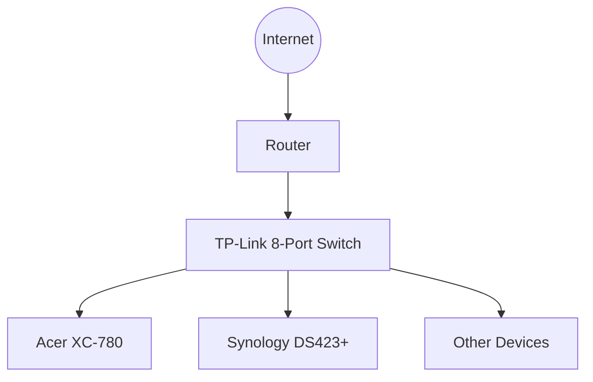
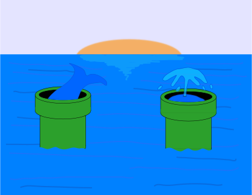

# Homlab V2

> v2 Is currently in progress, currently using a talos cluster and migrating all services,
> the README will be updated once full migration is complete with details on the migration,
> what services used etc. v1 README will still be available for reference

# 🏠 Homelab v1 Setup

<div align="center">


*A personal homelab environment with virtualization, media services, and remote access*

[Hardware](#-hardware) • [Network](#-network) • [Services](#-services) • [Future Plans](#-future-plans)

</div>

---

## 🔍 Quick Overview

> **What**: Home server setup for media, development, and learning  
> **Why**: Self-host services with full control and customization  
> **How**: Proxmox VE + Docker + LXC Containers  

---

## 💻 Hardware

<table>
  <tr>
    <th width="40%">Component</th>
    <th width="60%">Details</th>
  </tr>
  <tr>
    <td><strong>Main Server</strong><br/><i>Acer XC-780</i></td>
    <td>
      • Intel i5-7400<br/>
      • 16GB DDR4 RAM<br/>
      • NVIDIA GT-730
    </td>
  </tr>
  <tr>
    <td><strong>Storage</strong><br/><i>Synology DS423+</i></td>
    <td>
      • 2x 12TB drives in SHR<br/>
      • 1-drive fault tolerance<br/>
      • Dual Ethernet connectivity
    </td>
  </tr>
</table>

---

## 🌐 Network



> **Switch**: TP-Link 8-Port Unmanaged Gigabit Switch  
> **Connectivity**: All Ethernet (1Gbps)  
> **NAS Feature**: Link aggregation with dual Ethernet ports  

---

## 🧩 Software Architecture

<table>
  <tr>
    <th>Layer</th>
    <th>Component</th>
    <th>Purpose</th>
  </tr>
  <tr>
    <td rowspan="2"><strong>Base</strong></td>
    <td>Proxmox VE</td>
    <td>Hypervisor for VMs & LXC management</td>
  </tr>
  <tr>
    <td>Tailscale</td>
    <td>Secure remote access (exit node)</td>
  </tr>
  <tr>
    <td rowspan="2"><strong>Network</strong></td>
    <td>Nginx Proxy Manager</td>
    <td>Reverse proxy for service access</td>
  </tr>
  <tr>
    <td>DuckDNS</td>
    <td>Dynamic DNS for domain management</td>
  </tr>
</table>

---

## 🚀 Services

### Development Tools
- ⌨️ **Wastebin** - Code snippet sharing (LXC container)

### Media Stack
<div align="center">

| Icon | Service | Type | Function | Container |
|------|---------|------|----------|-----------|
|  | **Jellyfin** | 📺 Media | Streaming server | Docker |
|  | **qBittorrent** | ⬇️ Downloader | Torrent client | Docker |
|  | **Sonarr** | 📺 Manager | TV Shows | Docker |
|  | **Radarr** | 🎬 Manager | Movies | Docker |
|  | **Prowlarr** | 🔍 Indexer | Content search | Docker |
|  | **Bazarr** | 💬 Subtitles | Subtitle management | Docker |
|  | **NZBGet** | ⬇️ Downloader | Usenet client | Docker |
|  | **Gluetun** | 🔒 VPN | ExpressVPN binding | Docker |
|  | **Jellyseerr** | 🔍 Frontend | Media requests | Docker |
|  | **Notifiarr** | 🔔 Notifications | Discord alerts | Docker |

</div>

### DNS
- 🛜 **PI Hole** - Adblocking and DNS Sinkhole (running on nas) [ attached directly to router ]

> 💡 **Note**: All media services managed via Portainer in a dedicated LXC container
>
> ⚠️ **Current Issue**: Tdarr disabled due to GPU compatibility with Intel Arc A310

### Quality Setup
Sonarr and Radarr follow [TRaSH guides](https://trash-guides.info/) for optimal quality profiles.

---

## 🗄️ Storage Architecture

```
Synology DS423+ (24TB Raw / ~10.9TB Usable) 1 drive fault tolerance
├── NAS
│   ├── Movies
│   ├── Shows
│   ├── Music
│   ├── Youtube
│   └── Downloads
│       └── Qbittorrent
│           ├── Torrents
│           ├── Completed
│           └── Incomplete
│       └── Nzbget
│           ├── Queue
│           ├── Nzb
│           ├── Intermediate
│           ├── Tmp
│           └── Completed
│
├── TimeMachine ( Macbook Backups )
│
└── Docker
    └── Pihole
```

---

## 🔮 Future Plans

<div align="center">

### Current vs Future Architecture

| Component | Current | Planned |
|-----------|---------|---------|
| **Virtualization** | Proxmox VE | Talos Linux + K8s |
| **Container Mgmt** | Docker/Portainer | Kubernetes |
| **Cloud Integration** | None | Digital Ocean K8s |
| **GPU Access** | Disabled | Direct K8s passthrough |
| **Storage** | Direct mount | iSCSI for K8s |

</div>

### Migration Path
1. Set up Digital Ocean Kubernetes cluster
2. Migrate Docker containers to cloud K8s
3. Replace Proxmox with Talos Linux locally
4. Configure GPU passthrough
5. Implement iSCSI storage

> 🚧 **TODO**: Create detailed migration plan document with timeline

---

<div align="center">

## 🤝 Contributing

This is a personal project, but suggestions welcome via issues!

## 📜 License

[MIT License](LICENSE)

</div>

