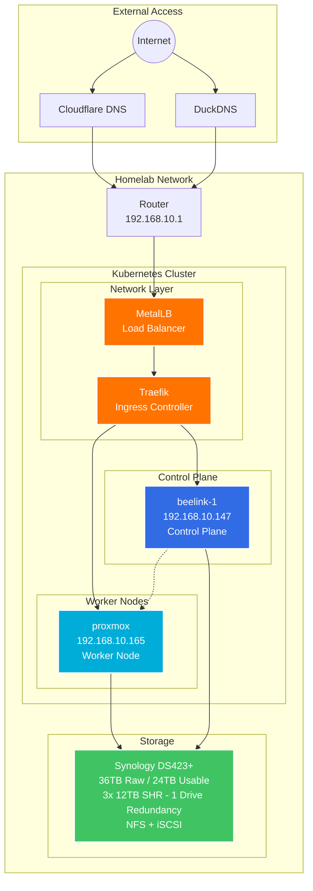

# 🏠 Homelab v2 - Kubernetes Edition

<div align="center">


_A modern homelab running on Kubernetes with Talos Linux, migrated from Proxmox/Docker_

[Architecture](#-architecture) • [Services](#-whats-running) • [Infrastructure](#-infrastructure-details) • [Deployment](#-deployment-guide) • [Roadmap](#-roadmap)

</div>

---

## 📖 Quick Overview

> **What**: Production-grade Kubernetes homelab for self-hosted services  
> **Why**: GitOps automation, better scalability, and learning cloud-native tech  
> **How**: Talos Linux bare-metal cluster with declarative configuration  
> **Docs**: [Detailed documentation on Obsidian](https://publish.obsidian.md/gauranshmathur)

---

## 🏗️ Architecture



---

## ✅ What's Running

### 🎬 Media Stack (`arr-stack` namespace)

<table>
<tr>
<th width="40%">Service</th>
<th width="30%">Purpose</th>
<th width="30%">Access</th>
</tr>
<tr>
<td colspan="3"><strong>🔒 VPN Group (Gluetun Sidecar)</strong></td>
</tr>
<tr>
<td>└─ qBittorrent</td>
<td>Torrent downloads</td>
<td>Port 8080</td>
</tr>
<tr>
<td>└─ NZBGet</td>
<td>Usenet downloads</td>
<td>Port 6789</td>
</tr>
<tr>
<td>└─ Prowlarr</td>
<td>Indexer management</td>
<td>Port 9696</td>
</tr>
<tr>
<td colspan="3"><strong>📺 Media Management</strong></td>
</tr>
<tr>
<td>Sonarr / Sonarr2</td>
<td>TV show automation</td>
<td>Ports 8989 / 8990</td>
</tr>
<tr>
<td>Radarr / Radarr2</td>
<td>Movie automation</td>
<td>Ports 7878 / 7879</td>
</tr>
<tr>
<td>Bazarr / Bazarr2</td>
<td>Subtitle management</td>
<td>Ports 6767 / 6768</td>
</tr>
<tr>
<td>Notifiarr</td>
<td>Discord notifications</td>
<td>Port 5454</td>
</tr>
</table>

### 🎭 Media Frontend (`jelly` namespace)

- **Jellyfin** - Media streaming server with Intel GPU transcoding
- **Jellyseerr** - Media request management

### 🛠️ Infrastructure Services

<table>
<tr>
<th>Service</th>
<th>Namespace</th>
<th>Purpose</th>
</tr>
<tr>
<td>Traefik</td>
<td>traefik</td>
<td>Ingress controller & reverse proxy</td>
</tr>
<tr>
<td>Cert-Manager</td>
<td>traefik</td>
<td>Automatic SSL certificates via DuckDNS</td>
</tr>
<tr>
<td>MetalLB</td>
<td>metallb</td>
<td>Bare-metal load balancer</td>
</tr>
<tr>
<td>K8s-Cleaner</td>
<td>k8s-cleaner</td>
<td>Cleanup completed pods/jobs</td>
</tr>
<tr>
<td>Descheduler</td>
<td>kube-system</td>
<td>Workload distribution optimization</td>
</tr>
<tr>
<td>NFS Provisioner</td>
<td>synology-csi</td>
<td>Dynamic volume provisioning</td>
</tr>
</table>

### 🤖 Other Services

- **LibreChat** (`ai-stuff` namespace) - Self-hosted AI chat interface with MongoDB backend

---

## 🔧 Infrastructure Details

### Cluster Configuration

```yaml
Cluster:
  OS: Talos Linux v1.6
  Kubernetes: v1.29
  CNI: Flannel

Nodes:
  - Name: beelink-1
    Role: Control Plane
    IP: 192.168.10.147
    Specs: Intel N100, 16GB RAM

  - Name: proxmox
    Role: Worker
    IP: 192.168.10.165
    Specs: Intel i5-7400, 16GB RAM, NVIDIA GT-730
```

### Storage Architecture

```
Synology DS423+ (24TB Raw / ~10.9TB Usable) 1 drive fault tolerance
├── /volume1/
│   ├── NAS/
│   │   ├── Movies
│   │   ├── Shows
│   │   ├── Music
│   │   ├── Youtube
│   │   └── Downloads/
│   │       ├── Qbittorrent/
│   │       │   ├── Torrents
│   │       │   ├── Completed
│   │       │   └── Incomplete
│   │       └── Nzbget/
│   │           ├── Queue
│   │           ├── Nzb
│   │           ├── Intermediate
│   │           ├── Tmp
│   │           └── Completed
│   │
│   ├── kube/                    # NFS-based PVCs
│   │   ├── jelly/
│   │   │   └── jellyseerr-pvc
│   │   ├── ai-stuff/
│   │   │   └── mongodb-backup-pvc
│   │   ├── default/
│   │   │   └── test-pvc-worker
│   │   └── test-nfs/
│   │       └── test-nfs-pvc
│   │
│   ├── TimeMachine/             # Macbook Backups
│   │
│   └── Docker/                  # Legacy
│       └── Pihole
│
└── iSCSI LUNs (19 total)        # High-performance PVCs
    ├── jellyfin-config          # Jellyfin configs (5Gi)
    ├── jellyfin-data            # Jellyfin metadata
    ├── jellyfin-cache           # Transcoding cache
    ├── jellyfin-log             # Jellyfin logs
    ├── arr-stack configs        # All *arr app configs
    ├── librechat volumes        # AI app storage
    └── ... (other service volumes)
```

**Storage Classes:**

- `nfs-client` - Dynamic NFS provisioning for general workloads
- `synology-iscsi` - iSCSI LUNs for high-performance/database workloads
- `syno-storage` - Synology CSI driver (alternative option)

### Network Configuration

- **Load Balancer**: MetalLB with IP pool `192.168.10.200-192.168.10.250`
- **Ingress**: Traefik v3 with automatic SSL
- **Domains**:
  - Local: `*.arkhaya.duckdns.org` (internal services)
  - Public: `*.arkhaya.xyz` (external access)
- **Security**: Cloudflare proxy for public services

---

## 📋 Roadmap

<div align="center">

[](https://publish.obsidian.md/gauranshmathur/Publish/Homelab)

_Synced from Obsidian on every push_

</div>

### 📌 Current Status

#### 📋 To Do

- [ ] n8n
- [ ] Homarr
- [ ] Jellyfin Stats
- [ ] Authentik
- [ ] Configure talos to pipe logs for node into loki
- [ ] Research and find the best way to handle secrets for cluster so we can not have it only on local machine

#### 🚧 In Progress

- [ ] External DNS
- [ ] Tdarr running on beelink cause we can have using iGPU and its quite decent

#### ✅ Recently Completed

- [x] Ghost Blog ✅ 2025-08-16
- [x] Huntarr + cleanuparr ✅ 2025-08-13
- [x] LGM Stack with alloy ✅ 2025-07-27
- [x] HA PostgreSQL ✅ 2025-08-05
- [x] Argo CD ✅ 2025-08-03

### 🚀 Future Projects

- [ ] \*arr Stack Migration (SQLite → PostgreSQL)
- [ ] MCP Server - Discord Media Bot
- [ ] Karakeep - bookmarking system

### 📦 Archive

- [x] librechat-migration ✅ 2025-07-02
- [x] jellyfin-migration ✅ 2025-07-06
- [x] talos-infrastructure ✅ 2025-07-06
- [x] tailscale-migration ✅ 2025-07-05
- [x] traefik-setup ✅ 2025-07-02
- [x] Figure out how to host updatable markdown so can show the Kanbans ( ~~if no other way just use vercel~~) ✅ 2025-06-14
- [x] arr-stack-migration ✅ 2025-07-02
- [x] synology-integration ✅ 2025-05-29
- [x] obsidian-setup ✅ 2025-05-29

---

## 🔧 Troubleshooting

### Cert-Manager DuckDNS Issues

When using cert-manager with DuckDNS webhook for wildcard certificates, you may encounter issues:

#### Common Problems:

1. **"no api token secret provided"** - The ClusterIssuer is looking for a secret in the wrong namespace
2. **DNS propagation timeouts** - DuckDNS can take 5-10 minutes to propagate DNS changes
3. **Wrong ClusterIssuer references** - Ensure you're using the Helm-deployed issuer

#### Solution:

If you installed the webhook via Helm:

```bash
helm install cert-manager-webhook-duckdns cert-manager-webhook-duckdns/cert-manager-webhook-duckdns \
  --namespace cert-manager \
  --set duckdns.token=$DUCKDNS_TOKEN \
  --set clusterIssuer.production.create=true \
  --set clusterIssuer.staging.create=true \
  --set clusterIssuer.email=gauranshmathur1999@gmail.com
```

Then use the Helm-created ClusterIssuer in your Certificate resources:

```yaml
apiVersion: cert-manager.io/v1
kind: Certificate
metadata:
  name: duckdns-wildcard-cert
  namespace: traefik
spec:
  secretName: duckdns-wildcard-tls
  issuerRef:
    name: cert-manager-webhook-duckdns-production # Helm-created issuer
    kind: ClusterIssuer
  dnsNames:
    - "arkhaya.duckdns.org"
    - "*.arkhaya.duckdns.org"
```

---

## 🛠️ Deployment Guide

### Prerequisites

1. **Hardware**: 2+ machines with 8GB+ RAM
2. **Network**: Static IPs, router access for port forwarding
3. **Storage**: NAS with NFS enabled
4. **Tools**: `kubectl`, `helm`, `talosctl`

### Quick Start

```bash
# 1. Apply Talos configuration
talosctl apply-config --nodes 192.168.10.147 --file controlplane.yaml
talosctl apply-config --nodes 192.168.10.165 --file worker.yaml

# 2. Bootstrap cluster
talosctl bootstrap --nodes 192.168.10.147

# 3. Get kubeconfig
talosctl kubeconfig --nodes 192.168.10.147

# 4. Install core services
kubectl apply -f kubernetes/namespaces/
helm install metallb metallb/metallb -n metallb -f helm/metallb/values.yaml
helm install traefik traefik/traefik -n traefik -f helm/traefik/values.yaml

# 5. Deploy applications
kubectl apply -k kubernetes/
```

### Directory Structure

```
Homelab/
├── kubernetes/         # Raw Kubernetes manifests
│   ├── arr-stack/     # Media automation stack
│   ├── jellyfin/      # Media server configs
│   └── ...
├── helm/              # Helm charts and values
│   ├── traefik/       # Ingress controller
│   ├── cert-manager/  # SSL certificates
│   └── ...
├── ansible/           # Migration playbooks
└── docs/             # Additional documentation
```

---

## 🔄 Migration from v1

### What Changed?

| Component      | v1 (Proxmox/Docker) | v2 (Kubernetes)        |
| -------------- | ------------------- | ---------------------- |
| **Platform**   | Proxmox VE + LXC    | Talos Linux bare-metal |
| **Containers** | Docker Compose      | Kubernetes deployments |
| **Networking** | Manual port mapping | Service mesh + ingress |
| **Storage**    | Local volumes       | Dynamic PVCs           |
| **Updates**    | Manual per-service  | Rolling updates        |
| **Backups**    | Scripts             | Persistent volumes     |

### Key Improvements

✅ **Declarative Configuration** - Everything as code  
✅ **Self-Healing** - Automatic pod restarts  
✅ **Easy Scaling** - Just update replica count  
✅ **Better Isolation** - Namespace separation  
✅ **Unified Ingress** - Single entry point  
✅ **Automated SSL** - Cert-manager handles certificates

### Challenges Solved

1. **VPN Networking** → Gluetun sidecar pattern
2. **GPU Transcoding** → Intel device plugin
3. **Data Migration** → Ansible playbooks
4. **Service Discovery** → CoreDNS + Traefik

---

## 📚 Resources

- 📖 [Full Documentation](https://publish.obsidian.md/gauranshmathur)
- 📜 [v1 README](README-v1.md) (Legacy setup)
- 🏷️ [Talos Linux Docs](https://www.talos.dev/)
- 🎯 [TRaSH Guides](https://trash-guides.info/) (Media quality settings)

---

## 🤝 Contributing

This is a personal project, but suggestions and improvements are welcome! Feel free to open an issue.

## 📄 License

[MIT License](LICENSE) - Feel free to use this as inspiration for your own homelab!

---

<div align="center">
<i>Built with ❤️ and lots of ☕</i>
</div>
