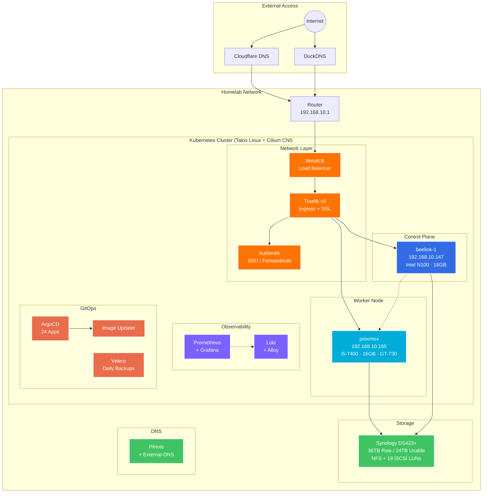

# 🏠 Homelab v2 - Kubernetes Edition

<div align="center">


_A modern homelab running on Kubernetes with Talos Linux, migrated from Proxmox/Docker_

[Architecture](#-architecture) • [Services](#-whats-running) • [Infrastructure](#-infrastructure-details) • [Deployment](#-deployment-guide) • [Roadmap](#-roadmap)

</div>

---

## 📖 Quick Overview

> **What**: Production-grade Kubernetes homelab for self-hosted services  
> **Why**: GitOps automation, better scalability, and learning cloud-native tech  
> **How**: Talos Linux bare-metal cluster with declarative configuration  
> **Board**: [Project Board on Jira](https://arkhaya.atlassian.net/jira/software/projects/KAN/board)

---

## 🏗️ Architecture


```mermaid
graph TB
    subgraph "External Access"
        Internet((Internet))
        CF[Cloudflare DNS]
        DD[DuckDNS]
    end

    subgraph "Homelab Network"
        Router[Router<br/>192.168.10.1]

        subgraph "Kubernetes Cluster (Talos Linux + Cilium CNI)"
            subgraph "Control Plane"
                CP[beelink-1<br/>192.168.10.147<br/>Intel N100 · 16GB]
            end

            subgraph "Worker Node"
                W1[proxmox<br/>192.168.10.165<br/>i5-7400 · 16GB · GT-730]
            end

            subgraph "Network Layer"
                MLB[MetalLB<br/>Load Balancer]
                TRF[Traefik v3<br/>Ingress + SSL]
                AUTH[Authentik<br/>SSO / ForwardAuth]
            end

            subgraph "Observability"
                PROM[Prometheus<br/>+ Grafana]
                LOKI[Loki<br/>+ Alloy]
            end

            subgraph "GitOps"
                ARGO[ArgoCD<br/>24 Apps]
                AIU[Image Updater]
                VELERO[Velero<br/>Daily Backups]
            end
        end

        subgraph "Storage"
            NAS[Synology DS423+<br/>36TB Raw / 24TB Usable<br/>NFS + 19 iSCSI LUNs]
        end

        subgraph "DNS"
            PIHOLE[PiHole<br/>+ External-DNS]
        end
    end

    Internet --> CF
    Internet --> DD
    CF --> Router
    DD --> Router
    Router --> MLB
    MLB --> TRF
    TRF --> AUTH
    TRF --> CP
    TRF --> W1
    CP -.-> W1
    W1 --> NAS
    CP --> NAS
    ARGO --> AIU
    PROM -.-> LOKI

    classDef control fill:#326CE5,stroke:#fff,stroke-width:2px,color:#fff
    classDef worker fill:#00ADD8,stroke:#fff,stroke-width:2px,color:#fff
    classDef network fill:#FF7300,stroke:#fff,stroke-width:2px,color:#fff
    classDef storage fill:#40C463,stroke:#fff,stroke-width:2px,color:#fff
    classDef gitops fill:#E96D4B,stroke:#fff,stroke-width:2px,color:#fff
    classDef obs fill:#7B61FF,stroke:#fff,stroke-width:2px,color:#fff

    class CP control
    class W1 worker
    class MLB,TRF,AUTH network
    class NAS,PIHOLE storage
    class ARGO,AIU,VELERO gitops
    class PROM,LOKI obs
```

---

## ✅ What's Running

### 🎬 Media Stack (`arr-stack` namespace)

<table>
<tr>
<th width="40%">Service</th>
<th width="30%">Purpose</th>
<th width="30%">Access</th>
</tr>
<tr>
<td colspan="3"><strong>🔒 VPN Group (Gluetun Sidecar)</strong></td>
</tr>
<tr>
<td>└─ qBittorrent</td>
<td>Torrent downloads</td>
<td>Port 8080</td>
</tr>
<tr>
<td>└─ NZBGet</td>
<td>Usenet downloads</td>
<td>Port 6789</td>
</tr>
<tr>
<td>└─ Prowlarr</td>
<td>Indexer management</td>
<td>Port 9696</td>
</tr>
<tr>
<td colspan="3"><strong>📺 Media Management</strong></td>
</tr>
<tr>
<td>Sonarr / Sonarr2</td>
<td>TV show automation</td>
<td>Ports 8989 / 8990</td>
</tr>
<tr>
<td>Radarr / Radarr2</td>
<td>Movie automation</td>
<td>Ports 7878 / 7879</td>
</tr>
<tr>
<td>Bazarr / Bazarr2</td>
<td>Subtitle management</td>
<td>Ports 6767 / 6768</td>
</tr>
<tr>
<td>Notifiarr</td>
<td>Discord notifications</td>
<td>Port 5454</td>
</tr>
</table>

### 🎭 Media Frontend (`jelly` namespace)

- **Jellyfin** - Media streaming server with Intel GPU transcoding
- **Jellyseerr** - Media request management

### 📊 Monitoring & Observability (`monitoring` namespace)

<table>
<tr>
<th width="40%">Service</th>
<th width="60%">Purpose</th>
</tr>
<tr>
<td>Prometheus (kube-prometheus-stack)</td>
<td>Metrics collection & alerting</td>
</tr>
<tr>
<td>Grafana</td>
<td>Dashboards & visualization</td>
</tr>
<tr>
<td>Loki</td>
<td>Log aggregation</td>
</tr>
<tr>
<td>Alloy</td>
<td>Telemetry collector (logs & metrics)</td>
</tr>
<tr>
<td>Discord Webhook Proxy</td>
<td>Routes critical/warning/status alerts to separate Discord channels</td>
</tr>
</table>

Custom homelab alert rules fire every 30 minutes with cluster status reports, plus event-driven alerts for pod failures, node issues, and PVC pressure.

### 🔒 Identity & Access (`authentik` namespace)

- **Authentik** (v2025.12.4) - Self-hosted SSO/Identity Provider with passkey login flows
  - Middleware applied to services via Traefik ForwardAuth
  - Backed by CNPG PostgreSQL database

### 🔄 Automation & GitOps

- **n8n** (v2.10.0, `n8n` namespace) - Visual workflow automation, backed by CNPG PostgreSQL
- **ArgoCD Image Updater** - Automatically commits new container image tags back to Git

### 🗄️ Data & Backup

- **CloudNativePG (CNPG)** (`default` namespace) - PostgreSQL operator managing databases for Authentik and n8n
- **Velero** (`velero` namespace) - Cluster backup & disaster recovery
  - Daily backups at 2 AM SGT to S3, 12-day retention
  - Covers all user namespaces + cluster-scoped resources (PVs, namespaces, RBAC)

### 🛠️ Infrastructure Services

<table>
<tr>
<th>Service</th>
<th>Namespace</th>
<th>Purpose</th>
</tr>
<tr>
<td>Traefik v3</td>
<td>traefik</td>
<td>Ingress controller & reverse proxy (2-replica HA)</td>
</tr>
<tr>
<td>Cert-Manager</td>
<td>traefik</td>
<td>Automatic SSL certificates via DuckDNS</td>
</tr>
<tr>
<td>MetalLB</td>
<td>metallb</td>
<td>Bare-metal load balancer</td>
</tr>
<tr>
<td>Cilium</td>
<td>kube-system</td>
<td>eBPF-based CNI networking</td>
</tr>
<tr>
<td>Sealed Secrets</td>
<td>kube-system</td>
<td>Encrypted secrets safe to commit to Git</td>
</tr>
<tr>
<td>External-DNS</td>
<td>misc</td>
<td>Automatic DNS record management via PiHole webhook</td>
</tr>
<tr>
<td>K8s-Cleaner</td>
<td>k8s-cleaner</td>
<td>Cleanup completed pods/jobs</td>
</tr>
<tr>
<td>Descheduler</td>
<td>kube-system</td>
<td>Workload distribution optimization</td>
</tr>
<tr>
<td>NFS Provisioner</td>
<td>synology-csi</td>
<td>Dynamic volume provisioning</td>
</tr>
</table>

---

## 🔧 Infrastructure Details

### Cluster Configuration

```yaml
Cluster:
  OS: Talos Linux v1.12.4
  Kubernetes: v1.35.0
  CNI: Cilium (eBPF)
  GitOps: ArgoCD (24 applications)

Nodes:
  - Name: beelink-1
    Role: Control Plane
    IP: 192.168.10.147
    Specs: Intel N100, 16GB RAM

  - Name: proxmox
    Role: Worker
    IP: 192.168.10.165
    Specs: Intel i5-7400, 16GB RAM, NVIDIA GT-730
```

### Storage Architecture

```
Synology DS423+ (24TB Raw / ~10.9TB Usable) 1 drive fault tolerance
├── /volume1/
│   ├── NAS/
│   │   ├── Movies
│   │   ├── Shows
│   │   ├── Music
│   │   ├── Youtube
│   │   └── Downloads/
│   │       ├── Qbittorrent/
│   │       │   ├── Torrents
│   │       │   ├── Completed
│   │       │   └── Incomplete
│   │       └── Nzbget/
│   │           ├── Queue
│   │           ├── Nzb
│   │           ├── Intermediate
│   │           ├── Tmp
│   │           └── Completed
│   │
│   ├── kube/                    # NFS-based PVCs
│   │   ├── jelly/
│   │   │   └── jellyseerr-pvc
│   │   ├── ai-stuff/               # (legacy)
│   │   ├── default/
│   │   │   └── test-pvc-worker
│   │   └── test-nfs/
│   │       └── test-nfs-pvc
│   │
│   ├── TimeMachine/             # Macbook Backups
│   │
│   └── Docker/                  # Legacy
│       └── Pihole
│
└── iSCSI LUNs (19 total)        # High-performance PVCs
    ├── jellyfin-config          # Jellyfin configs (5Gi)
    ├── jellyfin-data            # Jellyfin metadata
    ├── jellyfin-cache           # Transcoding cache
    ├── jellyfin-log             # Jellyfin logs
    ├── arr-stack configs        # All *arr app configs
    ├── misc service volumes     # Other app configs
    └── ... (other service volumes)
```

**Storage Classes:**

- `nfs-client` - Dynamic NFS provisioning for general workloads
- `synology-iscsi` - iSCSI LUNs for high-performance/database workloads
- `syno-storage` - Synology CSI driver (alternative option)

### Network Configuration

- **Load Balancer**: MetalLB with IP pool `192.168.10.200-192.168.10.250`
- **Ingress**: Traefik v3 with automatic SSL
- **Domains**:
  - Local: `*.arkhaya.duckdns.org` (internal services)
  - Public: `*.arkhaya.xyz` (external access)
- **Security**: Cloudflare proxy for public services

---

## 📋 Roadmap

<div align="center">

<em>Synced from <a href="https://arkhaya.atlassian.net/jira/software/projects/KAN/board">Jira</a> • Updates every 6 hours and on push</em>

</div>

<table>
<tr>
<td valign="top" width="33%">

<h3>To Do (4)</h3>

- Configure Prometheus and Grafana with Alert Manager for dashboarding and alerts<br>
- Add Prometheus alerting rule for Velero backup failures<br>
- Create new GPU node<br>
- Research on Calendarr and Lingarr and Maintainarr<br>

</td>
<td valign="top" width="33%">

<h3>In Progress (1)</h3>

- Fix jellyfin slow scrubbing and subtitles<br>

</td>
<td valign="top" width="33%">

<h3>Done (29)</h3>

- Figure out why aws s3 is more costly<br>
- Switch kanban to jira<br>
- Add kanban items to jira<br>
- Update Nvim config to add tab to fill and remove auto save reformat<br>
- Fix Traefik deprecated issues with routes<br>
- Fix n8n not updating to newest version via GitOps<br>
- Install Sealed Secrets<br>
- Convert all Secrets to sealed secrets<br>
- Work on lowering req and limits to allow Worker to run more<br>
- Random Kopia Job review and cleanup<br>
- Setup git-crypt for serena, claude etc<br>
- Look at how to be able to scrape and share the board in README<br>
- Issue with n8n connection to github using oauth2<br>
- Verify everything that needs to be backed up is being backed up<br>
- Add skills.md for claude to change how CLAUDE.md is used<br>
- Verify ArgoCD Helm argo image updater is working<br>
- Authentik - Identity Provider setup<br>
- Apply and configure Dashboard<br>
- Switch to seerr v3<br>
- Fix loki degradation<br>
- N8N using authentik middleware for routes<br>
- Create Discord Bot (Self Hosted)<br>
- Issue with duckdns cert<br>
- Import all users into Authentik then disable normal login<br>
- Create N8N workflow to update me on cluster issues<br>
- Use bot to send messages<br>
- Fix Failing VPN pod<br>
- [BUG] Authentik crash due to low storage in CNPG<br>
- [BUG] Jellyfin data pvc full<br>

</td>
</tr>
</table>

---
## 🔧 Troubleshooting

### Cert-Manager DuckDNS Issues

When using cert-manager with DuckDNS webhook for wildcard certificates, you may encounter issues:

#### Common Problems:

1. **"no api token secret provided"** - The ClusterIssuer is looking for a secret in the wrong namespace
2. **DNS propagation timeouts** - DuckDNS can take 5-10 minutes to propagate DNS changes
3. **Wrong ClusterIssuer references** - Ensure you're using the Helm-deployed issuer

#### Solution:

If you installed the webhook via Helm:

```bash
helm install cert-manager-webhook-duckdns cert-manager-webhook-duckdns/cert-manager-webhook-duckdns \
  --namespace cert-manager \
  --set duckdns.token=$DUCKDNS_TOKEN \
  --set clusterIssuer.production.create=true \
  --set clusterIssuer.staging.create=true \
  --set clusterIssuer.email=gauranshmathur1999@gmail.com
```

Then use the Helm-created ClusterIssuer in your Certificate resources:

```yaml
apiVersion: cert-manager.io/v1
kind: Certificate
metadata:
  name: duckdns-wildcard-cert
  namespace: traefik
spec:
  secretName: duckdns-wildcard-tls
  issuerRef:
    name: cert-manager-webhook-duckdns-production # Helm-created issuer
    kind: ClusterIssuer
  dnsNames:
    - "arkhaya.duckdns.org"
    - "*.arkhaya.duckdns.org"
```

---

## 🛠️ Deployment Guide

### Prerequisites

1. **Hardware**: 2+ machines with 8GB+ RAM
2. **Network**: Static IPs, router access for port forwarding
3. **Storage**: NAS with NFS enabled
4. **Tools**: `kubectl`, `helm`, `talosctl`

### Quick Start

```bash
# 1. Apply Talos configuration
talosctl apply-config --nodes 192.168.10.147 --file controlplane.yaml
talosctl apply-config --nodes 192.168.10.165 --file worker.yaml

# 2. Bootstrap cluster
talosctl bootstrap --nodes 192.168.10.147

# 3. Get kubeconfig
talosctl kubeconfig --nodes 192.168.10.147

# 4. Install core services
kubectl apply -f kubernetes/namespaces/
helm install metallb metallb/metallb -n metallb -f helm/metallb/values.yaml
helm install traefik traefik/traefik -n traefik -f helm/traefik/values.yaml

# 5. Deploy applications
kubectl apply -k kubernetes/
```

### Directory Structure

```
Homelab/
├── kubernetes/         # Raw Kubernetes manifests
│   ├── arr-stack/     # Media automation stack
│   ├── jellyfin/      # Media server configs
│   └── ...
├── helm/              # Helm charts and values
│   ├── traefik/       # Ingress controller
│   ├── cert-manager/  # SSL certificates
│   └── ...
├── ansible/           # Migration playbooks
└── docs/             # Additional documentation
```

---

## 🔄 Migration from v1

### What Changed?

| Component      | v1 (Proxmox/Docker) | v2 (Kubernetes)        |
| -------------- | ------------------- | ---------------------- |
| **Platform**   | Proxmox VE + LXC    | Talos Linux bare-metal |
| **Containers** | Docker Compose      | Kubernetes deployments |
| **Networking** | Manual port mapping | Service mesh + ingress |
| **Storage**    | Local volumes       | Dynamic PVCs           |
| **Updates**    | Manual per-service  | Rolling updates        |
| **Backups**    | Scripts             | Persistent volumes     |

### Key Improvements

✅ **Declarative Configuration** - Everything as code  
✅ **Self-Healing** - Automatic pod restarts  
✅ **Easy Scaling** - Just update replica count  
✅ **Better Isolation** - Namespace separation  
✅ **Unified Ingress** - Single entry point  
✅ **Automated SSL** - Cert-manager handles certificates

### Challenges Solved

1. **VPN Networking** → Gluetun sidecar pattern
2. **GPU Transcoding** → Intel device plugin
3. **Data Migration** → Ansible playbooks
4. **Service Discovery** → CoreDNS + Traefik

---

## 📚 Resources

- 📖 [Project Board](https://arkhaya.atlassian.net/jira/software/projects/KAN/board)
- 📜 [v1 README](README-v1.md) (Legacy setup)
- 🏷️ [Talos Linux Docs](https://www.talos.dev/)
- 🎯 [TRaSH Guides](https://trash-guides.info/) (Media quality settings)

---

## 🤝 Contributing

This is a personal project, but suggestions and improvements are welcome! Feel free to open an issue.

## 📄 License

[MIT License](LICENSE) - Feel free to use this as inspiration for your own homelab!

---

<div align="center">
<i>Built with ❤️ and lots of ☕</i>
</div>
